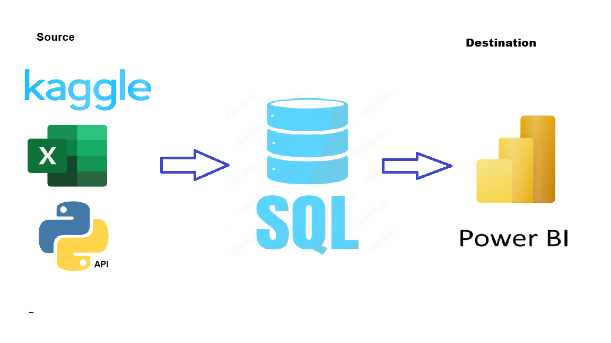

# # Data Portfolio: Excel to Power BI 

🏗️ Under Construction:

"I am currently enhancing this project by integrating advanced Power BI techniques, refined Excel configurations, and Python scripts for automated data processing. My focus is on elevating the visual storytelling and ensuring the technical architecture is robust and scalable."
😀😀😀

#Tabel of Concepts
--------
## Objective

### What is the key pain point?

The Head of Marketing wants to identify the top YouTubers in Poland in 2024 to determine which creators would be the most suitable for marketing campaigns throughout the rest of the year.
The dashboard integrates real-time 2026 data via the YouTube API to ensure up-to-date performance metrics.

### What is the ideal solution?

To create a dashboard that provides insights into the top Polish YouTubers in 2024, including:

- Subscriber count  
- Total views  
- Total videos  
- Engagement metrics  

This will help the marketing team make informed decisions about which YouTubers to collaborate with for their marketing campaigns.

#User story
As the Head of Marketing, I want to identify the top YouTubers in Poland based on subscriber count, videos uploaded and views accumulated, so that I can decide on which channels would be best to run marketing campaigns with to generate a good ROI. 

# Data Source

### What data is needed to achieve our objective?
We need data on the top YouTubers in Poland for 2024, including their:
* **Channel names**
* **Total subscribers**
* **Total views**
* **Total videos uploaded**

### Where is the data coming from? 
The data is sourced from **Kaggle** (via an Excel extract). You can find the original dataset here: [Kaggle YouTube Dataset](https://www.kaggle.com/datasets/bhavyadhingra00020/top-100-social-media-influencers-2024-countrywise?resource=download).

> **Note:** This project uses the 2024 Kaggle dataset as the baseline list of YouTube channels. Performance metrics—such as subscribers, views, and video counts—are dynamically updated using real-time **2026 data** fetched via the **YouTube API**.

## Stages

* **Design**
* **Development**
* **Testing**
* **Analysis**

## Dashboard Components Required

### What should the dashboard contain?
To determine the layout and functionality, the dashboard must answer the following key business questions:

- [ ] Who are the **top 10 YouTubers** with the most subscribers?
- [ ] Which **3 channels** have uploaded the most videos?
- [ ] Which **3 channels** have the most views?
- [ ] Which **3 channels** have the highest **average views** per video?
- [ ] Which **3 channels** have the highest **views per subscriber** ratio?
- [ ] Which **3 channels** have the highest **subscriber engagement rate** per video uploaded?

## Dashboard Mockup

### What should it look like?
To effectively answer our key questions, the dashboard will incorporate several data visualizations. The following components have been identified as appropriate for this project:

* **Table** – For detailed breakdowns of YouTuber metrics.
* **Treemap** – To visualize the distribution of subscribers or views across different categories.
* **Scorecards** – For high-level "at a glance" KPIs (e.g., total subscribers, total views).
* **Horizontal Bar Chart** – Ideal for ranking the top 10 channels and comparing performance.

[dashboard_mockup.png](asset/images/dashboard_mockup.png)

## Tools

| Tool | Purpose |
| :--- | :--- |
| **Excel** | Initial data exploration and quick profiling. |
| **Python** | Fetching real-time data from the YouTube API. |
| **SQL Server** | Cleaning, testing, and performing in-depth data analysis. |
| **Power BI** | Visualizing the data through interactive dashboards. |
| **GitHub** | Project documentation hosting and version control. |
| **Canva** | Designing the high-fidelity mockup of the dashboard. |

## Development

### Pseudocode

**What is the general approach in creating this solution from start to finish?**

1. **Get the Data** – Identify and collect the baseline dataset.
2. **Data Acquisition & Exploration** – Explore the data in **Excel** and fetch real-time metrics via the **YouTube API**.
3. **Data Ingestion** – Load the raw data into **SQL Server**.
4. **Data Cleaning** – Refine and format the data using **SQL** to ensure accuracy.
5. **Data Testing** – Run quality checks and validation scripts in **SQL**.
6. **Data Visualization** – Build interactive dashboards in **Power BI**.
7. **Insight Generation** – Analyze the visuals to generate findings and key takeaways.
8. **Documentation** – Write the technical documentation and project commentary.
9. **Deployment** – Publish the final project and documentation to **GitHub Pages**.

